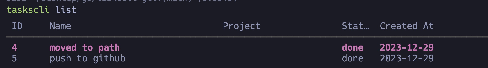

A simple todo list but in your cli.

At this point I am just using this to learn some conecepts in go.

This is how the list looks like right now. Probably will add some interactivity in the near future.

